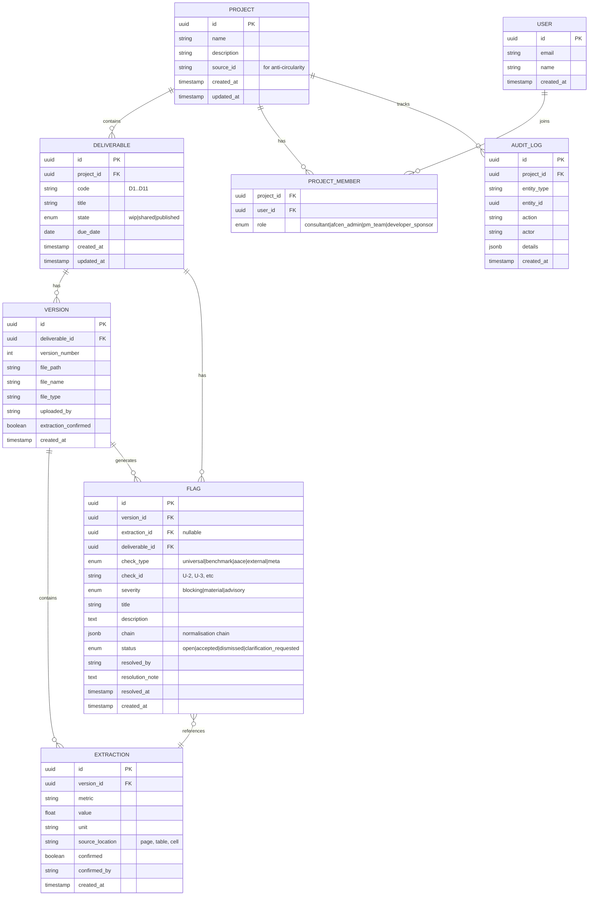

# AfCEN CDE Platform

## Overview

Build a Common Data Environment that hosts consultant deliverables through a WIP → Shared → Published lifecycle, runs automated first-pass checks (arithmetic, benchmark normalisation, AACE accuracy verification) when submissions move to Shared, and presents results in a side-by-side review UX where the PM team accepts or dismisses each flag. The benchmark engine (library.json + benchmark_lib.py) already exists as a validated Python CLI — the platform wraps it in a FastAPI service and adds document management, AI-assisted figure extraction, and a PM dashboard.

Pilot project: Bulambuli-Moroto 132 kV IPT (RFP-TFS-IPT-BM-002/2026).

## Problem Statement

Feasibility study reviews are manual, siloed, and non-cumulative. Each project's data, review comments, and version history scatter across email and static folders. The PM team's first-pass review — checking numbers, assumptions, and formats against industry norms — is done from scratch every time. The platform solves this by automating the arithmetic hygiene so the PM team's time goes to the engineering (see origin: docs/brainstorms/2026-07-15-afcen-cde-platform-requirements.md).

## Proposed Solution

FastAPI backend (Python) + Next.js frontend (App Router), deployed locally via Docker Compose for the Saturday demo and later to cloud for consultant mobilisation. The benchmark engine stays native in Python. AI-assisted extraction uses Claude API to pull figures from uploaded PDFs. PostgreSQL stores the document lifecycle, flags, and audit trail. The benchmark library stays as version-controlled JSON.

## Technical Approach

### Architecture

```
┌─────────────────────────────────────────────────────────────┐
│                    Next.js Frontend                         │
│  ┌──────────┐ ┌──────────────┐ ┌──────────┐ ┌───────────┐  │
│  │ Dashboard │ │ Side-by-Side │ │ Library  │ │  Export   │  │
│  │  (PM)    │ │   Review     │ │  Admin   │ │  Package  │  │
│  └──────────┘ └──────────────┘ └──────────┘ └───────────┘  │
└────────────────────────┬────────────────────────────────────┘
                         │ HTTP / REST
┌────────────────────────┴────────────────────────────────────┐
│                    FastAPI Backend                           │
│  ┌──────────┐ ┌──────────────┐ ┌──────────┐ ┌───────────┐  │
│  │Projects  │ │ Deliverables │ │Benchmark │ │Extraction │  │
│  │ Router   │ │   Router     │ │ Router   │ │  Router   │  │
│  └──────────┘ └──────────────┘ └──────────┘ └───────────┘  │
│  ┌──────────────────────────────────────────────────────┐   │
│  │              Services Layer                          │   │
│  │  check_service  │  extraction_service  │  export_svc │   │
│  └──────────────────────────────────────────────────────┘   │
│  ┌──────────────────────────────────────────────────────┐   │
│  │        Benchmark Engine (benchmark_lib.py)           │   │
│  │  validate │ find │ check │ aace_check │ escalate     │   │
│  └──────────────────────────────────────────────────────┘   │
└────────────────────────┬────────────────────────────────────┘
                         │
          ┌──────────────┼──────────────┐
          │              │              │
   ┌──────┴──────┐ ┌────┴────┐ ┌───────┴───────┐
   │ PostgreSQL  │ │ library │ │  File Storage  │
   │ (lifecycle, │ │  .json  │ │  (uploads/)    │
   │  flags,     │ │         │ │                │
   │  audit)     │ │         │ │                │
   └─────────────┘ └─────────┘ └───────────────┘
```

### Implementation Phases

#### Phase 1: Foundation (Day 1 — July 16)

**Goal**: Standing FastAPI + Next.js skeleton with database, benchmark API, and synthetic test data.

**Tasks:**

1.1. **Project scaffolding** — Replicate the HydroIQ pattern (see `HydroIQ/docker-compose.yml`, `run.py`, `backend/app/main.py`, `backend/app/database.py`):
   - `backend/` — FastAPI with async SQLAlchemy, Pydantic v2
   - `frontend/` — Next.js 16, shadcn v4, Tailwind v4, Recharts, Lucide
   - `docker-compose.yml` — PostgreSQL 16 + app services
   - `run.py` — uvicorn launcher for dev

1.2. **Database schema and models** — PostgreSQL via SQLAlchemy async (see ERD below):
   - `projects` — project metadata, multi-project from day one (R6)
   - `deliverables` — D1–D11 per project, state machine (wip/shared/published), due dates
   - `versions` — each upload is a version of a deliverable, immutable once created
   - `extractions` — AI-extracted figures mapped to benchmark metrics, confirmation status
   - `flags` — check results with severity, status (open/accepted/dismissed/clarification_requested), normalisation chain
   - `audit_log` — every state change, flag resolution, upload, approval
   - `users` / `project_members` — simplified for demo (seed data, no real auth)

1.3. **Copy and wrap benchmark engine** — Move `benchmark_lib.py`, `library.json`, `schema.json` into `backend/app/engine/`. Create `benchmark_service.py` exposing:
   - `POST /api/benchmarks/check` → wraps `check()`
   - `POST /api/benchmarks/aace` → wraps `aace_check()`
   - `GET /api/benchmarks/list` → wraps `find()` with query params
   - `GET /api/benchmarks/validate` → wraps `validate()`
   - `GET /api/benchmarks/sources` → returns source register
   - `POST /api/benchmarks/entries` → wraps `add_entry()` (Phase B)

1.4. **Synthetic reference PFS** — Generate a PDF with Table 8 data from the FS Review Standard Section 8:
   - Three route options (123, 141, 152 km)
   - OHL at 153,846 USD/km, substation at $5M, 10% contingency, 5% consultancy, 500 USD/km ESIA/RAP
   - ~8.65 acres/km land take, 1,000 USD/acre compensation
   - **Include the arithmetic error**: acres row summed into the currency total (Option 1 differs by $1,314.75)
   - Also create a second document for the Ghanzi-Gobabis ±35% accuracy range (for AACE demo beat)

1.5. **Core API routes** — FastAPI routers:
   - `POST /api/projects` / `GET /api/projects` / `GET /api/projects/{id}`
   - `POST /api/projects/{id}/deliverables` / `GET /api/projects/{id}/deliverables`
   - `POST /api/deliverables/{id}/versions` — file upload (multipart), creates a new version
   - `POST /api/deliverables/{id}/transition` — state machine: `{to_state: "shared"|"published"}` with guards
   - `GET /api/deliverables/{id}/flags` — list flags for a deliverable
   - `PATCH /api/flags/{id}` — accept, dismiss, or request clarification

**Deliverable**: Backend running, benchmark API responding, database seeded with a test project and the Bulambuli-Moroto deliverable set.

---

#### Phase 2: Intelligence Layer + Document UX (Day 2 — July 17)

**Goal**: AI extraction pipeline working, automated checks firing on state transition, side-by-side review UI.

**Tasks:**

2.1. **AI extraction service** — `extraction_service.py`:
   - Accept a PDF version, call Claude API to extract structured data (tables, key figures)
   - Prompt engineered to identify: cost tables, unit rates, totals, accuracy ranges, assumptions
   - Return structured extractions: `{metric, value, unit, source_location, confidence}`
   - **Demo reliability**: For the demo, hardcode a verified extraction mapping for the synthetic PFS alongside the live LLM pipeline. If live extraction matches, use it; if not, fall back to the hardcoded version. Log the discrepancy for debugging. (SpecFlow finding #7)

2.2. **Check orchestration service** — `check_service.py`:
   - Triggered when a deliverable transitions to Shared
   - Runs all applicable checks against confirmed extractions:
     - **U-2 (units)**: Detect non-currency quantities summed into currency totals
     - **U-3 (recomputation)**: Verify totals recompute from components
     - **U-4 (percentages)**: Verify percentages recompute from base
     - **Benchmark check**: For each extracted cost metric, call `benchmark_service.check()` with the project's parameters
     - **AACE check**: If an accuracy range is declared, call `benchmark_service.aace()` to verify conformance
   - Creates `Flag` records with severity, description, and the full normalisation chain
   - Creates `AuditLog` entries for each check run

2.3. **State machine with reverse transitions** (SpecFlow finding #1):
   - Forward: WIP → Shared (triggers checks), Shared → Published (requires all Blocking flags resolved)
   - Reverse: Shared → WIP ("withdraw" — consultant revises), Published → Shared ("revoke" — post-approval error found)
   - All transitions create audit log entries with actor and reason
   - Published → Shared requires PM team role
   - Guard: cannot transition to Published if any Blocking flag is still open

2.4. **Extraction failure handling** (SpecFlow finding #2):
   - If extraction returns nothing: create a meta-flag "Extraction incomplete — manual review required" with severity Advisory
   - If extraction is partial (e.g., 3 of 7 expected tables): create flags for extracted figures, plus a meta-flag listing what was not extracted
   - AfCEN admin can manually add extractions via `POST /api/versions/{id}/extractions`
   - Checks only fire on confirmed extractions — unconfirmed or missing extractions never produce benchmark flags

2.5. **Flag resolution with "request clarification"** (SpecFlow finding #3):
   - Flag status enum: `open | accepted | dismissed | clarification_requested`
   - `clarification_requested` records a note from the PM team and creates an audit entry
   - Flags in `clarification_requested` state are visible to the consultant (Phase B) and the PM team
   - For the demo, the PM team sees a "Request Clarification" button alongside Accept/Dismiss

2.6. **Next.js frontend — Side-by-side review page**:
   - URL: `/projects/[projectId]/deliverables/[deliverableId]`
   - **Left panel**: Document viewer — render PDF using a client-side PDF viewer (react-pdf or pdf.js). Show page navigation. For non-PDF files, show a download prompt.
   - **Right panel**: Review panel — list of flags grouped by check type (Universal / Benchmark / AACE), each as a card showing:
     - Severity badge (Blocking = red, Material = amber, Advisory = blue)
     - Flag title and description
     - Expandable normalisation chain (for benchmark flags)
     - Accept / Dismiss / Request Clarification buttons
     - Resolution status and actor
   - **Top bar**: Deliverable title, current state badge, version selector, state transition buttons (Submit to Shared, Approve to Published, Withdraw, Revoke)
   - **Extraction confirmation panel**: Before checks fire, show extracted figures for admin confirmation. Checkboxes per extraction. "Confirm & Run Checks" button.

2.7. **Next.js frontend — Project overview page**:
   - URL: `/projects/[projectId]`
   - List of deliverables with state badges and flag counts
   - Upload new version button per deliverable

**Deliverable**: Upload the synthetic PFS, extract figures (live or fallback), transition to Shared, see flags appear in the side-by-side view.

---

#### Phase 3: Dashboard, Export, and Demo Polish (Day 3 — July 18)

**Goal**: PM dashboard, one-click export, the three demo beats rehearsed and working.

**Tasks:**

3.1. **PM Dashboard** — `/projects/[projectId]/dashboard`:
   - **Flag summary**: Cards showing count by severity (Blocking / Material / Advisory), open vs resolved
   - **Upcoming gates**: Decision-gate dates for D1–D11 with days remaining, at-risk highlighting
   - **Turnaround time**: Time from last submission to Shared → first flag resolution, as a metric card
   - **Flag trend**: Recharts bar chart showing flags raised vs resolved over time
   - **Filterable by deliverable** — dropdown to scope the dashboard to a single deliverable

3.2. **One-click export** (R13) — `POST /api/projects/{id}/export`:
   - ZIP file containing:
     - All Published-state documents (latest version per deliverable)
     - A `manifest.json` listing each file, its deliverable code, approval date, approver
     - A `flag_summary.csv` listing all flags, their resolution, and the resolver
     - A `benchmark_report.pdf` (stretch) summarising the benchmark checks run
   - Scope: all Published deliverables in the project, not per-deliverable (SpecFlow finding #4 — resolved)

3.3. **Before/after demo moment** (R14):
   - Seed data: after the first submission is Published, add its line-cost figure to the benchmark library as a new entry (source_id matching the project)
   - Upload a second submission with a slightly different rate
   - Show that the check now has an additional reference point and resolves with a tighter band
   - Anti-circularity: the project's own entry is excluded when checking its own submissions via `--exclude-source` — show this in the chain

3.4. **Demo script and rehearsal**:
   - **Beat 1 — Arithmetic flag**: Upload synthetic PFS → transition to Shared → show the U-2/U-3 flag catching the $1,314.75 discrepancy (acres summed into currency total). Show the source: Table 8, Option 1.
   - **Beat 2 — Normalisation sequence**: Show the benchmark check on the 153,846 USD/km rate. First show what a naive check would produce (two false Material flags vs ACER and NCEP). Then show the normalised result: ESMAP developing-market adjustment clears the figure, terrain flag raised instead (flat rate with no Mt. Elgon differentiation). Expand the normalisation chain.
   - **Beat 3 — AACE check**: Upload the Ghanzi-Gobabis data with ±35% accuracy range. Show FR-24 catching the symmetric band — no AACE class is symmetric; cost risk skews positive. Run against AfCEN's own work to demonstrate fairness.
   - **Beat 4 — Dashboard**: Show the PM dashboard with open flags, gate dates, turnaround metrics.
   - **Beat 5 — Export**: One-click export of Published package, open the ZIP, show the manifest.

**Deliverable**: Complete working demo, rehearsed, running locally via Docker Compose.

---

#### Phase B: Consultant Mobilisation (Post-demo)

**Tasks (not day-scoped — ordered by dependency):**

B.1. **Authentication and RBAC** (R15):
   - NextAuth.js with email/password for simplicity, configurable per project
   - Four roles: consultant, afcen_admin, pm_team, developer_sponsor
   - Route guards in Next.js middleware
   - API guards in FastAPI dependency injection
   - Consultant: can upload to WIP, submit to Shared, cannot approve
   - Developer/sponsor: read-only Published material

B.2. **Deliverable tracking D1–D11** (R16):
   - TOR Section 8.1 timeline integration
   - Gantt-style timeline view on the project page
   - At-risk highlighting when a deliverable is within N days of its gate with no submission

B.3. **File format support** (R17):
   - PDF: already handled (Phase A)
   - Spreadsheets (XLSX/CSV): render with a table viewer component
   - GIS (Shapefile/GeoPackage): Mapbox GL or Leaflet with vector layer rendering
   - CAD (DWG/DXF): convert server-side to SVG using `ezdxf` (Python) for DXF; DWG needs ODA converter or a service
   - PowerFactory/PSS/E: metadata extraction + download only (no in-browser preview)
   - PLS-CADD: download only initially

B.4. **Specialist tool connectors** (R18):
   - Webhook-based API: third-party tools POST results to `/api/projects/{id}/external-checks`
   - Results are ingested as flags with `check_type: "external"` and source attribution
   - API key auth per integration

B.5. **Benchmark library management UI** (R19):
   - Admin page at `/admin/benchmarks`
   - Source register CRUD (add, edit, confirm licence)
   - Benchmark entry CRUD (add, supersede, edit confidence)
   - Escalation management (add index, set confirmed status)
   - All operations validate against FR-14 through FR-18 via the Python engine
   - Concurrency: optimistic locking on library.json version (SpecFlow finding #5 — library has a `library_version` field, use it as an ETag)

B.6. **Learning loop** (R20):
   - On Published transition: extract key figures → propose as benchmark entries
   - Admin reviews proposals in a queue at `/admin/benchmarks/proposals`
   - Accepted proposals are added via `add_entry()` with the project as source
   - Source_id is auto-generated from `{project_slug}_{deliverable_code}_{date}` to ensure anti-circularity matching (SpecFlow finding #5 — resolved)

B.7. **Methodology conformance** (R21) and **AACE class verification** (R22):
   - Extend the check service to verify which studies were performed (load flow, N-1, stability)
   - Cross-reference against the FS Review Standard Part B section criteria
   - AACE class declared in submission metadata → verified against deliverable maturity

B.8. **Cloud deployment** (R23):
   - Vercel for Next.js frontend
   - Railway or Render for FastAPI backend
   - Managed PostgreSQL (Neon, Supabase, or Railway)
   - S3 or Cloudflare R2 for file storage
   - Environment-based config switching (dev → staging → prod)

---

#### Phase C: Reusability and Replication (Post-mobilisation)

C.1. **Methodology replication** (R24) — FR-19 through FR-22
C.2. **Multi-project provisioning UI** (R25) — admin creates projects, configures RBAC
C.3. **Source register lifecycle** (R26) — automated re-check cycle
C.4. **LCOT computation** (R27) — ESMAP framework implementation

(Phase C is scoped but not detailed here — plan after Phase B delivery.)

## System-Wide Impact

### Interaction Graph

Upload → `create_version()` → stores file → returns version_id.
Transition to Shared → `transition_deliverable("shared")` → `extraction_service.extract(version)` → creates `Extraction` rows → admin confirms → `check_service.run_checks(version)` → creates `Flag` rows → creates `AuditLog` entries → updates dashboard metrics.
Flag resolution → `resolve_flag(flag_id, status, note)` → creates `AuditLog` entry → checks if all Blocking flags resolved (enables Published transition).
Transition to Published → `transition_deliverable("published")` → guard: no open Blocking flags → creates `AuditLog` → (Phase B) proposes benchmark entries.

### Error & Failure Propagation

- AI extraction failure → meta-flag created, no benchmark flags fire, admin can add manually
- Benchmark engine error (invalid metric, missing data) → flag creation skipped for that metric, error logged in audit, extraction marked with `check_error` note
- State transition guard failure → HTTP 422 with list of unresolved Blocking flags
- File upload failure → HTTP 500, no version created, no side effects

### State Lifecycle Risks

- **Partial extraction + check race**: Extraction confirmation and check execution must be sequential, not concurrent. Checks only run on confirmed extractions.
- **Version ordering**: A deliverable can have multiple versions. Flags always belong to a specific version. The review panel shows flags for the latest version by default, with a version selector to view historical flags.
- **Published revocation**: When Published → Shared, existing flags are preserved. New checks do NOT auto-run — the PM team re-transitions to Shared explicitly if they want re-checking.

### Integration Test Scenarios

1. Upload PDF → extract → confirm → transition to Shared → verify flags created with correct severity and chain
2. Resolve all Blocking flags → transition to Published → verify guard passes → verify audit trail
3. Two versions of same deliverable: verify flags are version-scoped, dashboard counts are correct
4. Benchmark check with `--exclude-source` on the project's own source_id → verify anti-circularity
5. AACE check with symmetric ±35% range → verify FR-24 flag fires with correct explanation

## Acceptance Criteria

### Phase A (Demo — July 18)

- [ ] Upload a PDF document, see it in WIP state
- [ ] Transition to Shared triggers AI extraction and automated checks
- [ ] Arithmetic flag (U-2, U-3) catches the $1,314.75 discrepancy with source reference
- [ ] Benchmark normalisation check shows the full chain: naive → normalised → terrain flag
- [ ] AACE symmetric-band flag fires on the Ghanzi-Gobabis ±35% range
- [ ] PM dashboard shows flag counts by severity, upcoming gates, turnaround time
- [ ] One-click export produces a ZIP with Published documents and manifest
- [ ] Before/after moment shows the learning loop direction with a tighter benchmark band
- [ ] Audit trail shows who submitted, reviewed, approved, with timestamps
- [ ] Side-by-side review UX: document left, flags right, accept/dismiss/clarify buttons

### Phase B (Consultant Mobilisation)

- [ ] Four-role RBAC enforced (consultant, admin, PM, sponsor) with per-project config
- [ ] D1–D11 tracking against TOR timeline with at-risk highlighting
- [ ] GIS and spreadsheet files render in-browser; CAD shows SVG conversion; other formats download
- [ ] Benchmark library management through the admin UI with FR-14–18 validation
- [ ] Learning loop: Published figures proposed as benchmark entries, admin confirms
- [ ] Cloud deployment with encryption, audit log, role-based access

### Phase C (Reusability)

- [ ] Methodology replication for available tool classes (where inputs exist)
- [ ] Multi-project provisioning through admin UI
- [ ] Source register lifecycle with automated re-check
- [ ] LCOT computation per ESMAP framework

## ERD — Core Data Model



## File Structure

```
/Users/dennisnderitu/Desktop/PFS/
├── backend/
│   ├── app/
│   │   ├── __init__.py
│   │   ├── main.py                     # FastAPI app, lifespan, CORS
│   │   ├── config.py                   # Settings (DB URL, Claude API key, upload dir)
│   │   ├── database.py                 # Async SQLAlchemy engine/session
│   │   ├── models/
│   │   │   ├── __init__.py
│   │   │   ├── project.py              # Project, ProjectMember
│   │   │   ├── deliverable.py          # Deliverable, Version
│   │   │   ├── flag.py                 # Flag
│   │   │   ├── extraction.py           # Extraction
│   │   │   └── audit.py               # AuditLog
│   │   ├── schemas/
│   │   │   ├── __init__.py
│   │   │   ├── project.py
│   │   │   ├── deliverable.py
│   │   │   ├── flag.py
│   │   │   ├── extraction.py
│   │   │   └── benchmark.py
│   │   ├── routers/
│   │   │   ├── __init__.py
│   │   │   ├── projects.py
│   │   │   ├── deliverables.py
│   │   │   ├── benchmarks.py
│   │   │   ├── flags.py
│   │   │   ├── extractions.py
│   │   │   └── export.py
│   │   ├── services/
│   │   │   ├── __init__.py
│   │   │   ├── benchmark_service.py    # Wraps benchmark_lib.py for API use
│   │   │   ├── extraction_service.py   # Claude API extraction pipeline
│   │   │   ├── check_service.py        # Orchestrates all checks on transition
│   │   │   └── export_service.py       # ZIP package builder
│   │   ├── engine/                     # Benchmark engine (copied from References/)
│   │   │   ├── __init__.py
│   │   │   ├── benchmark_lib.py
│   │   │   ├── library.json
│   │   │   └── schema.json
│   │   └── seed.py                     # Demo seed data
│   ├── uploads/                        # Local file storage (dev/demo)
│   ├── requirements.txt
│   ├── Dockerfile
│   └── .env.example
├── frontend/
│   ├── app/
│   │   ├── layout.tsx                  # Root layout, nav, theme
│   │   ├── page.tsx                    # Home → redirect to projects
│   │   ├── projects/
│   │   │   ├── page.tsx                # Project list
│   │   │   └── [projectId]/
│   │   │       ├── page.tsx            # Project overview, deliverable list
│   │   │       ├── dashboard/
│   │   │       │   └── page.tsx        # PM dashboard
│   │   │       └── deliverables/
│   │   │           └── [deliverableId]/
│   │   │               └── page.tsx    # Side-by-side review
│   │   └── admin/
│   │       └── benchmarks/
│   │           └── page.tsx            # Benchmark library management (Phase B)
│   ├── components/
│   │   ├── ui/                         # shadcn v4 components
│   │   ├── document-viewer.tsx         # PDF viewer (left panel)
│   │   ├── review-panel.tsx            # Flags list (right panel)
│   │   ├── flag-card.tsx               # Single flag with actions
│   │   ├── normalisation-chain.tsx     # Expandable benchmark chain
│   │   ├── extraction-confirm.tsx      # Extraction confirmation panel
│   │   ├── state-badge.tsx             # WIP/Shared/Published badge
│   │   ├── severity-badge.tsx          # Blocking/Material/Advisory badge
│   │   ├── dashboard-stats.tsx         # Dashboard stat cards
│   │   ├── flag-chart.tsx              # Recharts flag summary
│   │   └── gate-timeline.tsx           # Upcoming gates timeline
│   ├── lib/
│   │   ├── api.ts                      # Fetch wrapper for backend API
│   │   └── types.ts                    # TypeScript types matching Pydantic schemas
│   ├── package.json
│   ├── next.config.ts
│   ├── tailwind.config.ts              # Tailwind v4
│   ├── components.json                 # shadcn config
│   ├── tsconfig.json
│   ├── Dockerfile
│   ├── CLAUDE.md                       # → @AGENTS.md
│   └── AGENTS.md                       # Read Next.js docs from node_modules
├── seed/
│   ├── synthetic_pfs.py                # Script to generate synthetic PFS PDF
│   └── demo_data.json                  # Seed project, deliverables, users
├── docker-compose.yml                  # PostgreSQL + backend + frontend
├── run.py                              # Dev launcher (uvicorn + next dev)
├── .env.example
├── docs/
│   ├── brainstorms/
│   │   └── 2026-07-15-afcen-cde-platform-requirements.md
│   └── plans/
│       └── 2026-07-15-001-feat-afcen-cde-platform-plan.md
└── References/                         # Original reference documents (unchanged)
    ├── AfCEN_CDE_Platform_PRD.docx
    ├── AfCEN_FS_Deliverable_Review_Standard.docx
    ├── AfCEN_CDE_Addendum_Benchmark_Research_and_Verification.docx
    ├── AfCEN_CDE_Briefing_Note.docx
    ├── library.json
    ├── schema.json
    ├── benchmark_lib.py
    ├── benchmark_library.csv
    └── README (1).md
```

## Key Technical Decisions

| Decision | Rationale | Origin |
|---|---|---|
| FastAPI + Next.js | Benchmark engine stays native Python; frontend gets React + SSR | origin R1 |
| Side-by-side review UX | Avoids PDF overlay complexity, keeps flags in visual context | origin R2 |
| AI extraction with hardcoded fallback for demo | Live LLM extraction with a verified fallback ensures demo reliability | SpecFlow #7 |
| Reverse state transitions (Withdraw/Revoke) | PM team needs recourse after premature transitions; audit trail demands explicit events, not silent deletion | SpecFlow #1 |
| Flag "request clarification" status | The normalisation terrain flag is inherently a question, not a verdict — binary accept/dismiss is insufficient | SpecFlow #3 |
| Export = all Published deliverables in project | Lender data room needs the complete package, not per-deliverable exports | SpecFlow #4 |
| Benchmark library stays as JSON | Version-controlled, diffable, CLI-accessible; dataset too small to need a database | origin R4 |
| SQLite for dev, PostgreSQL for demo+ | Follows HydroIQ pattern; Docker Compose brings up PostgreSQL for the demo | HydroIQ pattern |
| Hardcoded extraction for demo, live for Phase B | Ensures the 3 demo beats are reproducible regardless of LLM variance | SpecFlow #7 |

## Dependencies & Prerequisites

- Python 3.11+ with FastAPI, SQLAlchemy async, Pydantic v2, anthropic SDK
- Node.js 20+ with Next.js 16, React 19, shadcn v4, Tailwind v4
- Docker + Docker Compose
- Claude API key (for extraction service)
- Synthetic PFS PDF (generated in Phase 1)
- Benchmark library v0.1.0 (exists in References/)

## Risk Analysis & Mitigation

| Risk | Impact | Mitigation |
|---|---|---|
| AI extraction unreliable on synthetic PDF | Demo fails | Hardcoded extraction fallback; test PDF format early on Day 1 |
| Escalation index is placeholder | Normalisation demo produces only Advisory flags | Acceptable — the demo narrative explains this is deliberate conservatism per FR-15 |
| 3-day timeline too tight | Incomplete demo | Cut export (Beat 5) first; the three flag beats and the dashboard are the core story |
| PDF viewer integration slow | Side-by-side UX incomplete | Use an iframe with the browser's native PDF renderer as fallback |
| Next.js 16 API changes | Frontend code doesn't work | Read `node_modules/next/dist/docs/` before coding per AGENTS.md |

## Outstanding Questions (Deferred to Planning — Now Addressed)

| Question | Resolution |
|---|---|
| Which LLM for extraction? | Claude API via anthropic SDK. Prompt: extract all tables from the PDF, return structured JSON with metric, value, unit, source_location. Hardcoded fallback for demo. |
| Auth provider for Phase B? | NextAuth.js with email/password. Simple, self-hosted, no external dependency. |
| File format preview libraries? | GIS: Mapbox GL JS. DXF: ezdxf → SVG. DWG: ODA converter. XLSX: read with openpyxl, render as HTML table. PowerFactory/PLS-CADD: download only. |
| Benchmark library concurrency? | Optimistic locking on `library_version` field. Read version → modify → write with version check → retry on conflict. |
| PSS/E-class replication tools? | Deferred to Phase C. pandapower (Python) for basic power flow. Full PSS/E replication requires the utility's model. |
| Database schema? | See ERD above. |
| Which Part A checks for demo? | U-2 (units) and U-3 (recomputation) — both are fully automatable from extracted table data. U-4 (percentages) as stretch. |

## Constraints (from origin, carried forward)

- All checks are **advisory only** — flags are questions for the PM team, not findings against the Consultant
- The platform **never auto-corrects** submitted figures (FR-5)
- The learning loop (FR-11) is **internal only** — never visible to consultants or bidders
- Benchmark library provenance and confidence fields are **AfCEN's internal asset**
- The Consultant remains the **sole signatory** (TOR Section 8.3)
- The PM team remains the **sole approval authority**

## Sources & References

### Origin

- **Origin document:** [docs/brainstorms/2026-07-15-afcen-cde-platform-requirements.md](docs/brainstorms/2026-07-15-afcen-cde-platform-requirements.md) — Key decisions: FastAPI + Next.js stack (R1), side-by-side review UX (R2), AI-assisted extraction (R3), local-first deployment (R5), phased build (A/B/C)

### Internal References

- Benchmark engine: `References/benchmark_lib.py` — `check()`, `aace_check()`, `validate()`, `find()`, `add_entry()`, `escalate()`
- Benchmark data: `References/library.json` — 22 entries, 12 adjustments, 5 sources
- Schema: `References/schema.json` — JSON Schema for library validation
- PRD: `References/AfCEN_CDE_Platform_PRD.docx` — FR-1 through FR-12
- FS Review Standard: `References/AfCEN_FS_Deliverable_Review_Standard.docx` — checks U-1 to U-10, Part B section criteria, Part C benchmarks
- Benchmark Addendum: `References/AfCEN_CDE_Addendum_Benchmark_Research_and_Verification.docx` — FR-13 through FR-24
- Briefing Note: `References/AfCEN_CDE_Briefing_Note.docx` — stakeholder map, positioning constraints
- HydroIQ project pattern: `/Users/dennisnderitu/Desktop/HydroIQ/` — FastAPI + Next.js 16 + shadcn v4 + Docker Compose
